DNA Methylation Analysis Pipeline
================
Deniz Ertuğrul
2025-09-21

## Step 1: Load raw data

First, we load the sample sheet which contains metadata about our
samples.

``` r
# Load the inputs
SampleSheet <- read.table("Input_Data/SampleSheet_Report_II.csv",sep=",",header=T)
targets <- read.metharray.sheet("Input_Data")
```

    ## [1] "Input_Data/SampleSheet_Report_II.csv"

``` r
targets
```

    ##     SampleID    Sex Group  Array        Slide
    ## 1 GSM5319592   Male  CTRL R01C02 200121140049
    ## 2 GSM5319603   Male   DIS R02C02   3999356129
    ## 3 GSM5319604 Female   DIS R02C01   3999547012
    ## 4 GSM5319607   Male  CTRL R03C02   3999547012
    ## 5 GSM5319609 Female   DIS R02C01   3999547016
    ## 6 GSM5319613 Female   DIS R02C01   3999547017
    ## 7 GSM5319615 Female  CTRL R04C01   3999547017
    ## 8 GSM5319616 Female  CTRL R06C01   3999547017
    ##                                    Basename
    ## 1 Input_Data/GSM5319592_200121140049_R01C02
    ## 2   Input_Data/GSM5319603_3999356129_R02C02
    ## 3   Input_Data/GSM5319604_3999547012_R02C01
    ## 4   Input_Data/GSM5319607_3999547012_R03C02
    ## 5   Input_Data/GSM5319609_3999547016_R02C01
    ## 6   Input_Data/GSM5319613_3999547017_R02C01
    ## 7   Input_Data/GSM5319615_3999547017_R04C01
    ## 8   Input_Data/GSM5319616_3999547017_R06C01

We use the `minfi` package to load the raw intensity data into an
`RGChannelSet` object, which we call `RGset`.

``` r
RGset <- read.metharray.exp(targets = targets, extended = TRUE)
print(RGset)
```

    ## class: RGChannelSetExtended 
    ## dim: 622399 8 
    ## metadata(0):
    ## assays(5): Green Red GreenSD RedSD NBeads
    ## rownames(622399): 10600313 10600322 ... 74810490 74810492
    ## rowData names(0):
    ## colnames(8): GSM5319592_200121140049_R01C02
    ##   GSM5319603_3999356129_R02C02 ... GSM5319615_3999547017_R04C01
    ##   GSM5319616_3999547017_R06C01
    ## colData names(7): SampleID Sex ... Basename filenames
    ## Annotation
    ##   array: IlluminaHumanMethylation450k
    ##   annotation: ilmn12.hg19

## Step 2: Create Red and Green dataframes

We extract the raw fluorescence intensities from the Red and Green
channels into separate data frames.

``` r
Red <- data.frame(getRed(RGset))
Green <- data.frame(getGreen(RGset))

cat("Dimensions of Red channel matrix:", dim(Red), "\n")
```

    ## Dimensions of Red channel matrix: 622399 8

``` r
cat("Dimensions of Green channel matrix:", dim(Green), "\n")
```

    ## Dimensions of Green channel matrix: 622399 8

## Step 3: Check fluorescences for a specific probe

We inspect the Red and Green fluorescence values for the probe with
address `71636344`. We also check the manifest file to determine its
type and color.

``` r
assigned_address <- "71636344"

# Checking the manifest file to get probe info
manifest_data <- getAnnotation(RGset)

probe_info <- manifest_data[manifest_data$AddressA == assigned_address | 
                            manifest_data$AddressB == assigned_address, ]
df_probe_info <- data.frame(probe_info)
df_probe_info
```

    ##             chr       pos strand       Name AddressA AddressB
    ## cg15056966 chr3 120003702      + cg15056966 71636344         
    ##                                                     ProbeSeqA ProbeSeqB Type
    ## cg15056966 AAAACTCTCATAAAAACTTAAAATAAACAAAAATCACRCATCAAAAATAC             II
    ##            NextBase Color Probe_rs Probe_maf CpG_rs CpG_maf SBE_rs SBE_maf
    ## cg15056966                    <NA>        NA   <NA>      NA   <NA>      NA
    ##                        Islands_Name Relation_to_Island
    ## cg15056966 chr3:120003883-120004426            N_Shore
    ##                                                                                                                        Forward_Sequence
    ## cg15056966 CGGCCCCATCTTCACACCAAATTACAGTACTCTCCCGTCTCTTCCACTGAAATTGCCACT[CG]CATCCCTGATGCGTGACCCCTGCTCACCTCAAGTTCCTATGAGAGTTTCTTTACCGGTTC
    ##                                                     SourceSeq Random_Loci
    ## cg15056966 CGCATCCCTGATGCGTGACCCCTGCTCACCTCAAGTTCCTATGAGAGTTT            
    ##            Methyl27_Loci UCSC_RefGene_Name UCSC_RefGene_Accession
    ## cg15056966                                                       
    ##            UCSC_RefGene_Group Phantom DMR Enhancer            HMM_Island
    ## cg15056966                                    TRUE 3:121486306-121486449
    ##            Regulatory_Feature_Name Regulatory_Feature_Group  DHS
    ## cg15056966                                                  TRUE

``` r
# Extract the fluorescence values for this address
red_fluor <- Red[rownames(Red) == assigned_address, ]
green_fluor <- Green[rownames(Green) == assigned_address, ]

# Create a data frame
fluorescence_data <- data.frame(
  Sample = colnames(RGset),
  Red_fluor = as.numeric(red_fluor),
  Green_fluor = as.numeric(green_fluor),
  Type = probe_info$Type
)

fluorescence_data
```

    ##                           Sample Red_fluor Green_fluor Type
    ## 1 GSM5319592_200121140049_R01C02       473         412   II
    ## 2   GSM5319603_3999356129_R02C02       184         264   II
    ## 3   GSM5319604_3999547012_R02C01       721         871   II
    ## 4   GSM5319607_3999547012_R03C02      1305        1003   II
    ## 5   GSM5319609_3999547016_R02C01       373         165   II
    ## 6   GSM5319613_3999547017_R02C01      1233        1254   II
    ## 7   GSM5319615_3999547017_R04C01      1639        1303   II
    ## 8   GSM5319616_3999547017_R06C01       695         683   II

The address `71636344` corresponds to a Type II probe.

## Step 4: Create the MSet.raw object

``` r
MSet.raw <- preprocessRaw(RGset)
print(MSet.raw)
```

    ## class: MethylSet 
    ## dim: 485512 8 
    ## metadata(0):
    ## assays(2): Meth Unmeth
    ## rownames(485512): cg00050873 cg00212031 ... ch.22.47579720R
    ##   ch.22.48274842R
    ## rowData names(0):
    ## colnames(8): GSM5319592_200121140049_R01C02
    ##   GSM5319603_3999356129_R02C02 ... GSM5319615_3999547017_R04C01
    ##   GSM5319616_3999547017_R06C01
    ## colData names(7): SampleID Sex ... Basename filenames
    ## Annotation
    ##   array: IlluminaHumanMethylation450k
    ##   annotation: ilmn12.hg19
    ## Preprocessing
    ##   Method: Raw (no normalization or bg correction)
    ##   minfi version: 1.54.1
    ##   Manifest version: 0.4.0

## Step 5: Perform Quality Checks

### QC Plot

The QC plot shows the log2 median intensity of the methylated (M) and
unmethylated (U) signals for each sample. Low-quality samples would
appear as outliers with significantly lower intensities.

``` r
qc <- getQC(MSet.raw)
plotQC(qc)
```

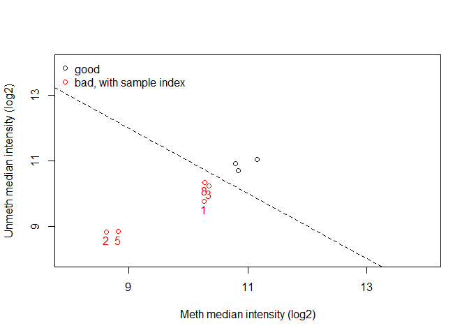<!-- -->

Here we have only 3 good samples and 5 bad samples which are: 1,2,3,5,8.

### Negative Controls

Negative control probes are designed to have no matching sequence in the
human genome. Their intensity should be low, reflecting background
noise. High intensity could indicate technical issues like non-specific
binding.

``` r
controlStripPlot(RGset, controls = "NEGATIVE")
```

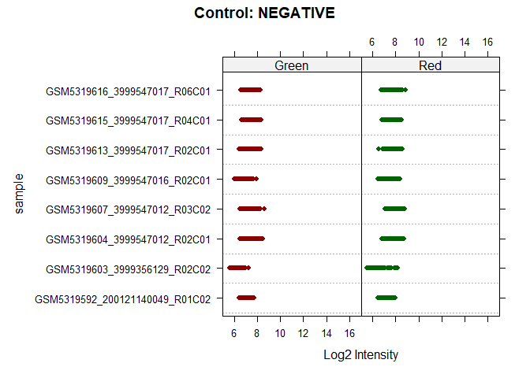<!-- -->

### Detection P-values

A detection p-value is calculated for each probe in each sample,
comparing its signal to the background noise level from the negative
controls. A high p-value (e.g., \> 0.05) suggests the probe’s signal is
unreliable. p-value threshold is **0.05**. We count the number of failed
probes for each sample.

``` r
# Calculate detection p-values
detP <- detectionP(RGset)
detP_threshold <- 0.05

# For each sample, count how many probes have a p-value higher than the threshold
failed_probes_count <- colSums(detP > detP_threshold)

# Create the results table
failed_probes_table <- data.frame(
  Sample = names(failed_probes_count),
  Failed_Probes = failed_probes_count
)
failed_probes_table
```

    ##                                                        Sample Failed_Probes
    ## GSM5319592_200121140049_R01C02 GSM5319592_200121140049_R01C02           202
    ## GSM5319603_3999356129_R02C02     GSM5319603_3999356129_R02C02           306
    ## GSM5319604_3999547012_R02C01     GSM5319604_3999547012_R02C01          1156
    ## GSM5319607_3999547012_R03C02     GSM5319607_3999547012_R03C02           366
    ## GSM5319609_3999547016_R02C01     GSM5319609_3999547016_R02C01          2735
    ## GSM5319613_3999547017_R02C01     GSM5319613_3999547017_R02C01           460
    ## GSM5319615_3999547017_R04C01     GSM5319615_3999547017_R04C01           384
    ## GSM5319616_3999547017_R06C01     GSM5319616_3999547017_R06C01           674

## Step 6: Raw Beta and M-values

Now we calculate Beta (β) values (ratio of methylated to total signal,
ranging from 0 to 1) and M-values (log-ratio of signals) from the raw
data. We then plot the density of the average values for each group
(CTRL and DIS) to observe the overall methylation landscape.

``` r
beta.raw <- getBeta(MSet.raw)
beta.raw <- na.omit(beta.raw)

is_ctrl <- targets$Group == "CTRL"
is_dis <- targets$Group == "DIS"

# Calculate raw M-values
m.raw <- getM(MSet.raw)


# Separate Beta values for CTRL and DIS groups
beta_ctrl <- beta.raw[, is_ctrl]
beta_dis <- beta.raw[, is_dis]

# Separate M values for CTRL and DIS groups
m_ctrl <- m.raw[, is_ctrl]
m_dis <- m.raw[, is_dis]


# Calculate the mean Beta values for each group
mean_beta_ctrl <- apply(beta_ctrl,1,mean,na.rm=T)
mean_beta_dis <- apply(beta_dis,1,mean,na.rm=T)

# Calculate densities of beta
d_mean_of_beta_ctrl<- density(mean_beta_ctrl,na.rm=T)
d_mean_of_beta_dis <- density(mean_beta_dis,na.rm=T)

# Calculate the mean M values for each group
mean_m_ctrl <- apply(m_ctrl,1,mean,na.rm=T)
mean_m_dis <- apply(m_dis,1,mean,na.rm=T)

# Calculate densities of M
d_mean_of_M_ctrl<- density(mean_m_ctrl,na.rm=T)
d_mean_of_M_dis <- density(mean_m_dis,na.rm=T)


# Plot for Mean Beta Values
plot(d_mean_of_beta_ctrl, col = "blue",
     main = "Density of Mean Beta Values: CTRL vs. DIS",
     xlab = "Mean Beta Value",
     ylab = "Density")
lines(d_mean_of_beta_dis, col = "red")
legend("topright", legend = c("CTRL", "DIS"), col = c("blue", "red"), lty = 1)
```

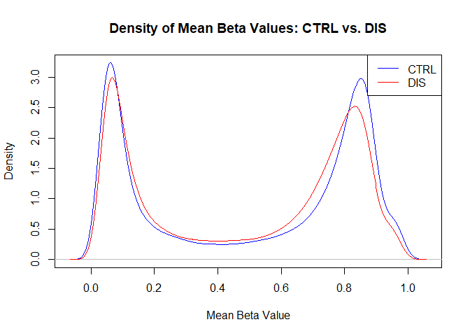<!-- -->

``` r
# Plot for Mean M Values
plot(d_mean_of_M_ctrl, col = "blue",
     main = "Density of Mean M Values: CTRL vs. DIS",
     xlab = "Mean M Value",
     ylab = "Density")
lines(d_mean_of_M_dis, col = "red")
legend("topright", legend = c("CTRL", "DIS"), col = c("blue", "red"), lty = 1)
```

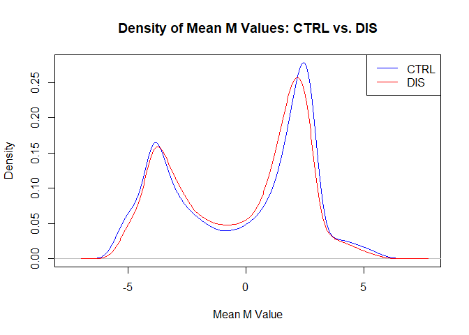<!-- -->

The density plots for both Beta and M values show small but clear
differences between the control (CTRL) and disease (DIS) groups. In both
plots, the CTRL group has higher peaks at high and low methylation
levels, meaning more sites are either lowly or highly methylated. The
DIS group, on the other hand, has fewer sites at these extremes, showing
a more moderate methylation pattern. Although the overall shapes of the
two distributions look similar, these small changes might point to real
biological differences. More statistical testing is needed to know if
these differences are truly important.

## Step 7: Normalize data and compare

We normalize the data using the `preprocessNoob` function and compare
the distributions before and after.

``` r
MSet.norm <- preprocessNoob(RGset)
beta_norm <- getBeta(MSet.norm)
```

We divide the raw and normalized data according to type I and type II
probes, calculate the mean and the standartd deviation for each probe
across the 8 samples and calculate the density distributions

``` r
annotation <- getAnnotation(MSet.raw)

# Get the names (IlmnID) for Type I and Type II probes
typeI_probes <- rownames(annotation)[annotation$Type == "I"]
typeII_probes <- rownames(annotation)[annotation$Type == "II"]

# Define colors and sample groups for the boxplots
group_factor <- as.factor(targets$Group)
group_colors <- c("CTRL" = "blue", "DIS" = "red")

# Raw Data Calculations
# 1. Divide the raw beta matrix by probe type
beta_raw_I <- beta.raw[rownames(beta.raw) %in% typeI_probes, ]
beta_raw_II <- beta.raw[rownames(beta.raw) %in% typeII_probes, ]

# Calculate the mean for each probe across all 8 samples
mean_beta_raw_I <- apply(beta_raw_I, 1, mean, na.rm = TRUE)
mean_beta_raw_II <- apply(beta_raw_II, 1, mean, na.rm = TRUE)

# Calculate the density of these means
d_mean_beta_raw_I <- density(mean_beta_raw_I, na.rm = TRUE)
d_mean_beta_raw_II <- density(mean_beta_raw_II, na.rm = TRUE)

# Calculate the standard deviation for each probe across all 8 samples
sd_beta_raw_I <- apply(beta_raw_I, 1, sd, na.rm = TRUE)
sd_beta_raw_II <- apply(beta_raw_II, 1, sd, na.rm = TRUE)

# Calculate the density of these standard deviations
d_sd_beta_raw_I <- density(sd_beta_raw_I, na.rm = TRUE)
d_sd_beta_raw_II <- density(sd_beta_raw_II, na.rm = TRUE)


# Norm Data Calculations
# Divide the normalized beta matrix by probe type
beta_norm_I <- beta_norm[rownames(beta_norm) %in% typeI_probes, ]
beta_norm_II <- beta_norm[rownames(beta_norm) %in% typeII_probes, ]

# Calculate the mean for each probe
mean_beta_norm_I <- apply(beta_norm_I, 1, mean, na.rm = TRUE)
mean_beta_norm_II <- apply(beta_norm_II, 1, mean, na.rm = TRUE)

# Calculate the density of these means
d_mean_beta_norm_I <- density(mean_beta_norm_I, na.rm = TRUE)
d_mean_beta_norm_II <- density(mean_beta_norm_II, na.rm = TRUE)

# Calculate the standard deviation for each probe
sd_beta_norm_I <- apply(beta_norm_I, 1, sd, na.rm = TRUE)
sd_beta_norm_II <- apply(beta_norm_II, 1, sd, na.rm = TRUE)

# Calculate the density of these standard deviations
d_sd_beta_norm_I <- density(sd_beta_norm_I, na.rm = TRUE)
d_sd_beta_norm_II <- density(sd_beta_norm_II, na.rm = TRUE)
```

And then we plot them!

``` r
# Set up a 2x3 grid for the plots
par(mfrow = c(2, 3))

# Top row: Raw Data
plot(d_mean_beta_raw_I, col = "blue", main = "Raw Beta Mean", xlab = "Mean Beta", ylim = c(0, 8))
lines(d_mean_beta_raw_II, col = "red")
legend("topright", legend = c("Type I", "Type II"), col = c("blue", "red"), lty = 1, bty = "n")

plot(d_sd_beta_raw_I, col = "blue", main = "Raw Beta SD", xlab = "Standard Deviation")
lines(d_sd_beta_raw_II, col = "red")

boxplot(beta.raw,
        main = "Raw Beta Values per Sample",
        ylab = "Beta Value",
        cex.axis = 0.7,
        las = 2,
        col = group_colors[group_factor])
legend("topright", legend = levels(group_factor), fill = group_colors, bty = "n")

# Bottom row: Normalized Data
plot(d_mean_beta_norm_I, col = "blue", main = "Normalized Beta Mean", xlab = "Mean Beta", ylim = c(0, 8))
lines(d_mean_beta_norm_II, col = "red")

plot(d_sd_beta_norm_I, col = "blue", main = "Normalized Beta SD", xlab = "Standard Deviation")
lines(d_sd_beta_norm_II, col = "red")

boxplot(beta_norm,
        main = "Normalized Beta Values per Sample",
        ylab = "Beta Value",
        cex.axis = 0.7,
        las = 2,
        col = group_colors[group_factor])
```

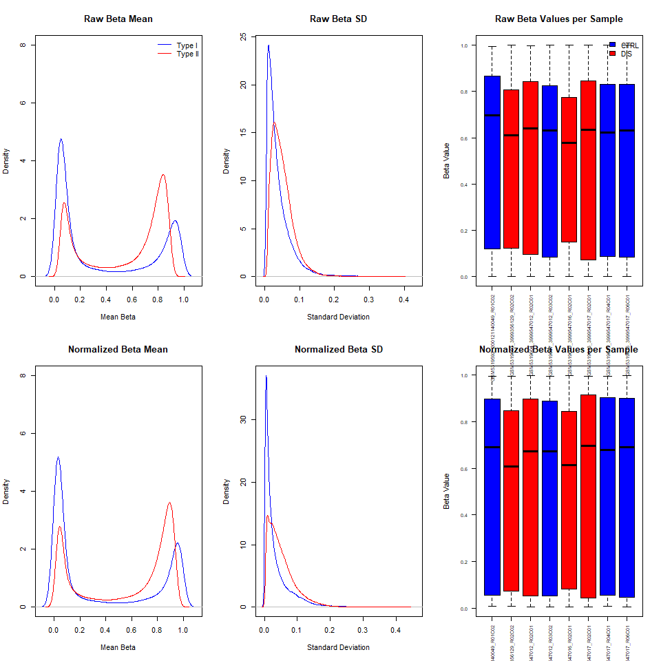<!-- -->

``` r
par(mfrow = c(1, 1))
```

The comparison between raw and Noob-normalized beta values shows
improvements in data quality and consistency after normalization.

When comparing the normalization effect on peak intensities on mean beta
plot, the normalized data can be seen to succesfully corrected the
Infinium II assay’s shift towards the centre for its inability of
detection of extreme methylation values. This suggests reduced
measurement noise and better separation between methylated and
unmethylated states.

Importantly, normalization lowers the standard deviation of beta values,
helping to minimize technical variability, including the systematic
differences between Infinium I and Infinium II probe types.

In addition, the boxplots indicate that the distribution of beta values
within each sample becomes more compact and consistent after
normalization. However, this effect is a bit underwhelming as the box
plots we got from this function are still pretty variable. But this is
expected as Noob normalization is primarily a background and dye bias
correction and doesn’t handle between-array variability as well as other
methods like Quantile Normalization.

Overall, preprocessNoob improves the precision and comparability of the
data when compared to the raw values, making downstream methylation
analyses more reliable. However, using Quantile Normalization would
result in less variable data compared to our normalization function as
Noob failed to reduce the between-platform artefacts well. So, this
might not be the best normalization method for our data.

## Step 8: PCA

``` r
pca_results <- prcomp(t(beta_norm),scale=T)
print(summary(pca_results))
```

    ## Importance of components:
    ##                             PC1      PC2       PC3       PC4      PC5       PC6
    ## Standard deviation     455.4170 314.4188 218.96568 204.62511 193.1050 165.69916
    ## Proportion of Variance   0.4272   0.2036   0.09875   0.08624   0.0768   0.05655
    ## Cumulative Proportion    0.4272   0.6308   0.72956   0.81580   0.8926   0.94916
    ##                              PC7       PC8
    ## Standard deviation     157.11459 3.356e-12
    ## Proportion of Variance   0.05084 0.000e+00
    ## Cumulative Proportion    1.00000 1.000e+00

``` r
plot(pca_results)
```

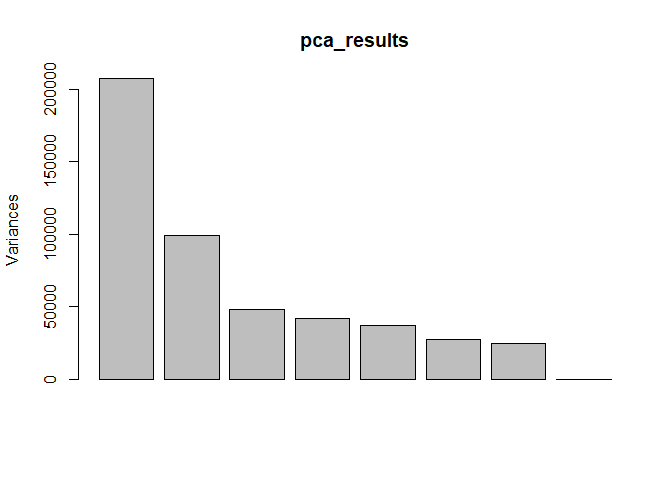<!-- -->

``` r
plot(pca_results$x[,1], pca_results$x[,2],cex=1,pch=2)
```

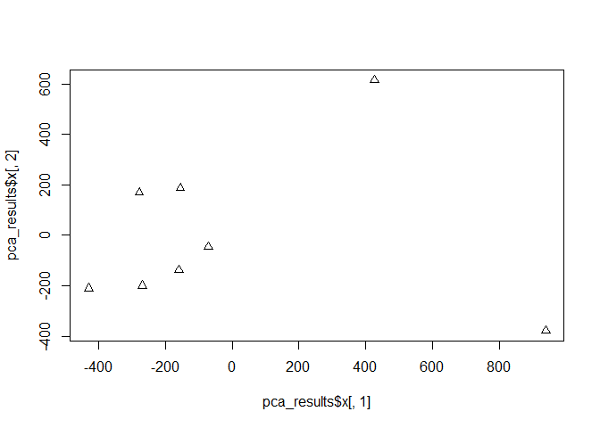<!-- -->

``` r
SampleSheet$Group <- as.factor(SampleSheet$Group)
SampleSheet$Sex <- as.factor(SampleSheet$Sex)
SampleSheet$Sentrix_ID <- as.factor(SampleSheet$Sentrix_ID)

# color by group
plot(pca_results$x[,1], pca_results$x[,2],cex=2,pch=2,col=SampleSheet$Group,xlab="PC1",ylab="PC2",xlim=c(-1000,1000),ylim=c(-1000,1000), main="PCA Plot by Group")
legend("topright",legend=levels(SampleSheet$Group),col=c(1:nlevels(SampleSheet$Group)),pch=2)
```

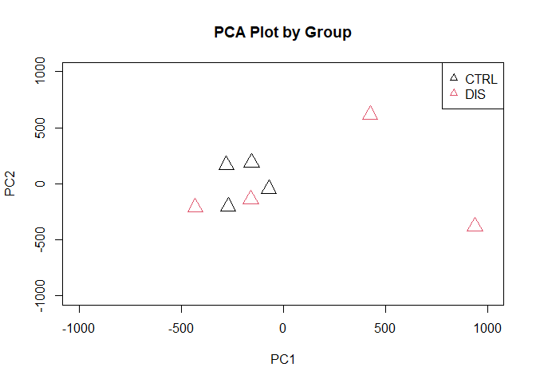<!-- -->

``` r
# color by sex
plot(pca_results$x[,1], pca_results$x[,2],cex=2,pch=2,col=SampleSheet$Sex,xlab="PC1",ylab="PC2",xlim=c(-1000,1000),ylim=c(-1000,1000), main="PCA Plot by Sex")
legend("topright",legend=levels(SampleSheet$Sex),col=c(1:nlevels(SampleSheet$Sex)),pch=2)
```

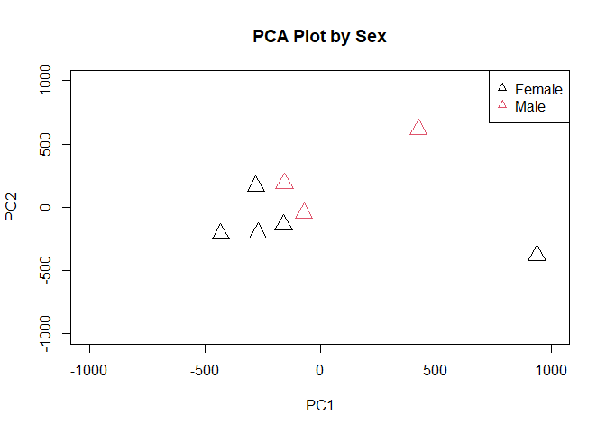<!-- -->

``` r
# color by sentrix_id
plot(pca_results$x[,1], pca_results$x[,2],cex=2,pch=2,col=SampleSheet$Sentrix_ID,xlab="PC1",ylab="PC2",xlim=c(-1000,1000),ylim=c(-1000,1000), main="PCA Plot by Sentrix ID")
legend("topright", legend=levels(SampleSheet$Sentrix_ID),col=c(1:nlevels(SampleSheet$Sentrix_ID)),pch=2, inset=c(0, 0)) 
```

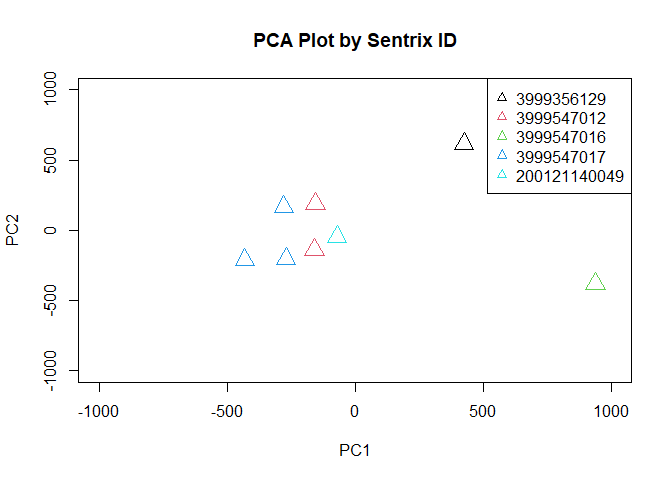<!-- -->

**Group**: The plot shows poor separation between the CTRL and DIS
groups in the main cluster of points (towards the center-left), groups
are heavily intermixed. However, there are two very distinct outliers,
both of which are DIS. These two samples are located far away from all
the others.

**Sex**: There is no clear separation based on sex. The main cluster is
a mix of males and females. The two outliers are identified as one male
and one female.

**Sentrix ID**: While the red, blue, and cyan groups are clustered
together, there’s a slight separation among them, suggesting subtle
differences. This is expected as Sentrix ID a technical variable showing
sequencing flow cell lane used. The outliers are on their own Sentrix
ID. So the fact that they are outliers might be explained as technical
variability.

## Step 9: Identify differentially methylated probes

Using the normalized data, we now search for differentially methylated
probes (DMPs) between the CTRL and DIS groups. We use the dmpFinder
function from the minfi package. This function performs a probe-wise
F-test to identify positions that are differentially methylated between
groups. We use M-values for the statistical test as their distribution
is more suitable for linear models.

``` r
m_norm <- getM(MSet.norm)
dmps <- dmpFinder(m_norm, pheno = targets$Group, type = "categorical")
head(dmps)
```

    ##             intercept         f         pval       qval
    ## cg24361198  3.8150938 1028.8168 6.104639e-08 0.02052985
    ## cg00707134 -0.2316448  603.9264 2.985933e-07 0.05020834
    ## cg13754720  0.9386031  455.9675 6.880121e-07 0.07712598
    ## cg14380635  1.7310017  308.8796 2.177700e-06 0.17978437
    ## cg13746854 -0.7455456  286.7428 2.711512e-06 0.17978437
    ## cg26849776  2.9438437  270.8403 3.207579e-06 0.17978437

## Step 10: Apply multiple test correction

When testing hundreds of thousands of probes simultaneously, we must
correct for multiple hypothesis testing to avoid a high rate of false
positives. We will count the number of significant probes using the
nominal (uncorrected) p-value, the stringent Bonferroni correction, and
the less conservative Benjamini-Hochberg (BH) or False Discovery Rate
(FDR) correction. We use a significance threshold of 0.05.

``` r
alpha <- 0.05

# Number of DMPs with nominal p-value < 0.05
n_nominal <- sum(dmps$pval < alpha, na.rm = TRUE)

# Number of DMPs after Bonferroni correction
p_bonferroni_adj <- p.adjust(dmps$pval, method = "bonferroni")
n_bonferroni <- sum(p_bonferroni_adj < alpha, na.rm = TRUE)

# Number of DMPs after Benjamini-Hochberg (BH) correction
p_bh_adj <- p.adjust(dmps$pval, method = "BH")
n_bh <- sum(p_bh_adj < alpha, na.rm = TRUE)

cat("Number of DMPs with nominal p-value < 0.05:", n_nominal, "\n")
```

    ## Number of DMPs with nominal p-value < 0.05: 16474

``` r
cat("Number of DMPs after Bonferroni correction (p < 0.05):", n_bonferroni, "\n")
```

    ## Number of DMPs after Bonferroni correction (p < 0.05): 1

``` r
cat("Number of DMPs after BH correction (FDR < 0.05):", n_bh, "\n")
```

    ## Number of DMPs after BH correction (FDR < 0.05): 1

## Step 11: Produce a volcano plot and a Manhattan plot

- A Volcano Plot displays statistical significance (-log10 p-value)
  versus magnitude of change (delta beta), allowing us to easily
  identify probes that are both statistically significant and
  biologically meaningful.

- A Manhattan Plot shows the genomic location of each probe against its
  significance, helping to identify chromosomal regions enriched with
  DMPs.

``` r
# Volcano Plot

delta_beta <- rowMeans(beta_norm[, targets$Group == "DIS"]) - rowMeans(beta_norm[, targets$Group == "CTRL"])
dmps$deltaBeta <- delta_beta[rownames(dmps)]

dmps$significant <- ifelse(p_bh_adj < 0.05, "FDR < 0.05", "Not Significant")

volcano_plot <- ggplot(data = dmps, aes(x = deltaBeta, y = -log10(pval), color = significant)) +
  geom_point(alpha = 0.4, size = 1.5) +
  scale_color_manual(values = c("FDR < 0.05" = "red", "Not Significant" = "grey")) +
  labs(title = "Volcano Plot of DMPs",
       x = "Delta Beta (DIS - CTRL)",
       y = "-log10(p-value)") +
  theme_minimal() +
  theme(legend.position="bottom") +
  geom_hline(yintercept = -log10(dmps$pval[n_bh]), linetype = "dashed") # Line for FDR 0.05 threshold

volcano_plot
```

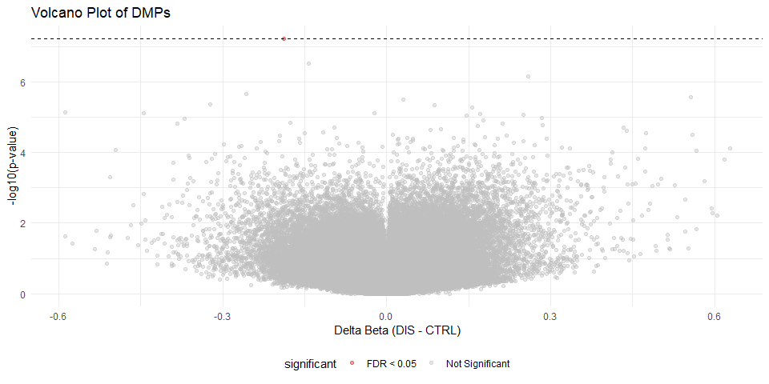<!-- -->

``` r
# Manhattan Plot
ann <- getAnnotation(MSet.norm)
ann_df <- data.frame(ann[c("chr", "pos")])

dmps_with_ann <- merge(dmps, ann_df, by = "row.names")
colnames(dmps_with_ann)[1] <- "ProbeID"

# Clean up chromosome names for plotting
dmps_with_ann <- dmps_with_ann[!is.na(dmps_with_ann$chr), ]
dmps_with_ann$chr_num <- gsub("chr", "", dmps_with_ann$chr)
dmps_with_ann$chr_num[dmps_with_ann$chr_num == "X"] <- 23
dmps_with_ann$chr_num[dmps_with_ann$chr_num == "Y"] <- 24
dmps_with_ann$chr_num <- as.numeric(dmps_with_ann$chr_num)

# Create the Manhattan plot
manhattan_plot <- ggplot(dmps_with_ann, aes(x = pos, y = -log10(pval), color = as.factor(chr_num))) +
  geom_point(alpha = 0.7, size = 1) +
  facet_grid(. ~ chr_num, scale = "free_x", space = "free_x") +
  labs(title = "Manhattan Plot", x = "Genomic Position", y = "-log10(p-value)") +
  theme_bw() +
  theme(axis.text.x = element_blank(),
        axis.ticks.x = element_blank(),
        legend.position = "none"
  )

manhattan_plot
```

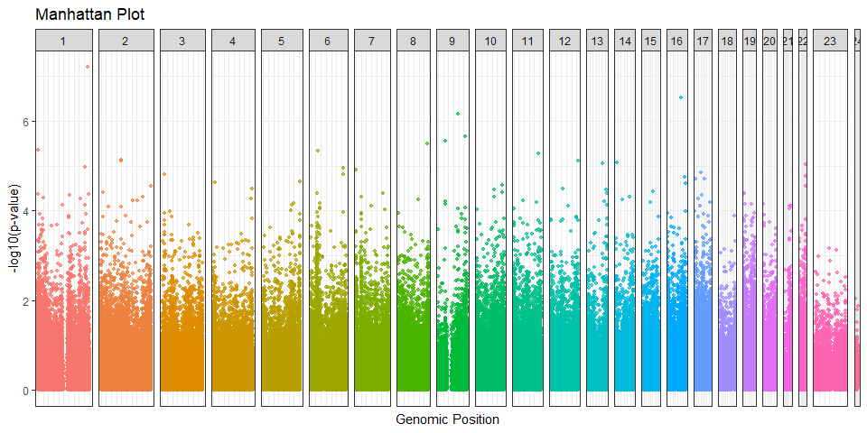<!-- -->

## Step 12: Produce a heatmap of the top 100 significant DMPs

``` r
# Order DMPs by p-value to find the top 100
dmps_ordered <- dmps[order(dmps$pval), ]
top100_probes <- rownames(dmps_ordered)[1:100]

# Extract the normalized beta values for these top 100 probes
top100_beta_matrix <- beta_norm[top100_probes, ]

# Create an annotation data frame for the columns (samples)
annotation_col <- data.frame(
  Group = targets$Group,
  Sex = targets$Sex
)
rownames(annotation_col) <- colnames(top100_beta_matrix)


# Generate the heatmap
pheatmap(top100_beta_matrix,
         main = "Top 100 Differentially Methylated Probes",
         show_rownames = FALSE,
         scale = "row"
         )
```

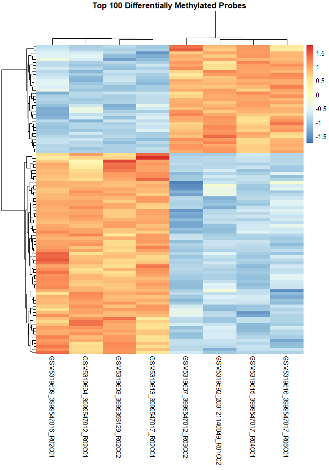<!-- -->
